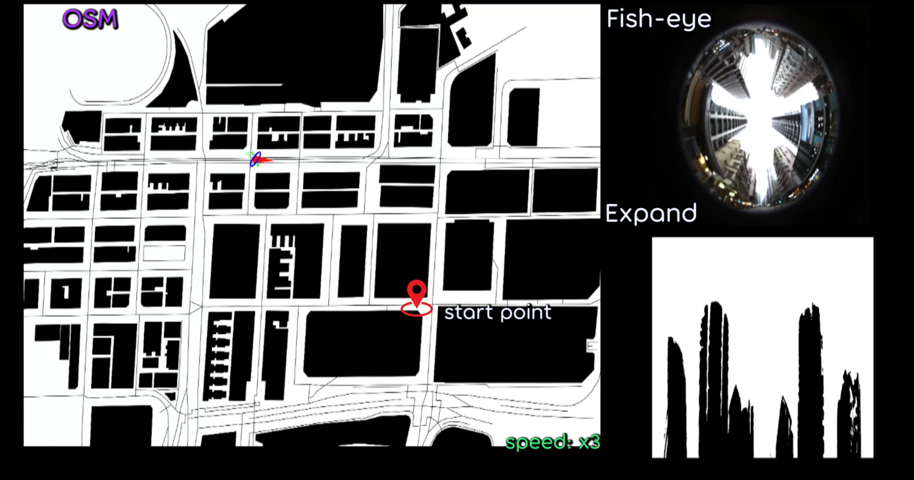

# SkyLoc

The official implementation of SkyLoc.  
The code and dataset will be open-sourced upon acceptance of the paper.  
The accompanied video can be found at: https://youtu.be/cb6afp_Q_GA  

         Figure 1. Successfully converge in Sequence-00, Ma Tau Kok, Hong Kong 

